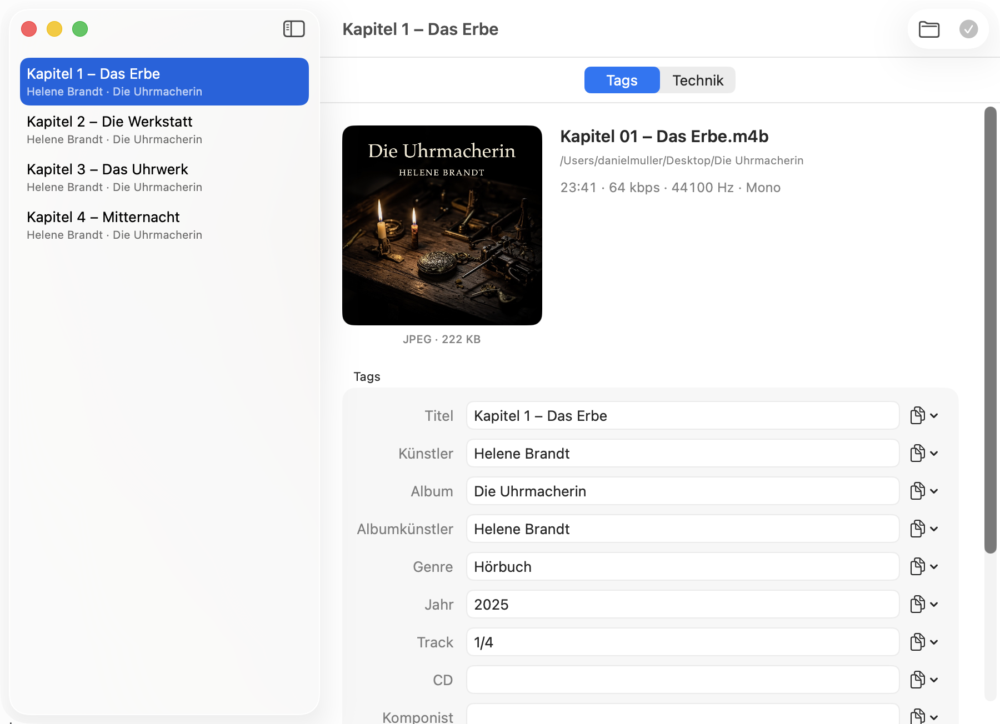
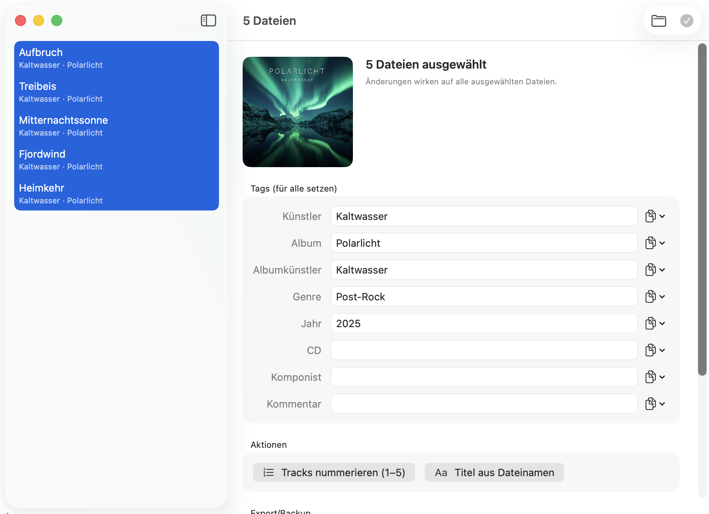
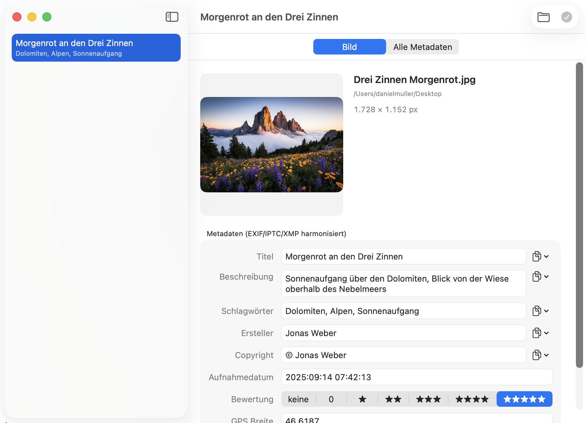
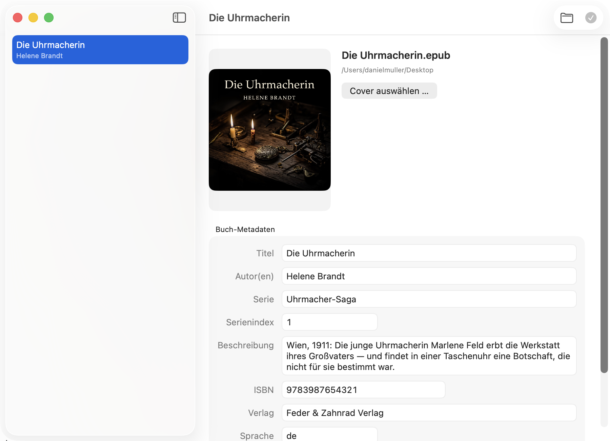
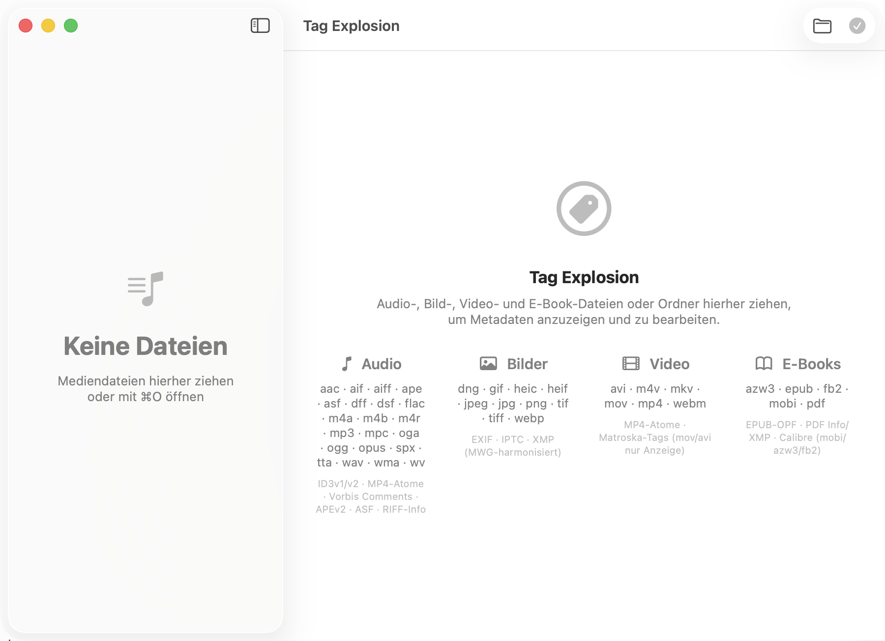

# Tag Explosion

Native macOS-App zum Anzeigen und Bearbeiten von Medien-Metadaten — Audio-Tags,
Bild-Metadaten (EXIF/IPTC/XMP), Video-Tags und E-Book-Metadaten in einem
schnellen Editor im Apple-Stil, mit skriptfähiger CLI.

**🌐 Sprache / Language:** [English](README.md) · [Deutsch](README.de.md)



*Der Audio-Editor: Cover, alle Tag-Felder und an jedem Feld ein Kopier-Menü.*

## Funktionen

- **Audio** — alle Tag-Felder inklusive Custom-Keys, Coverbilder und
  Batch-Bearbeitung: gemeinsame Felder, Tracks nummerieren, Titel aus
  Dateinamen, ein Cover für alle Dateien.
- **Bilder** — EXIF/IPTC/XMP nach MWG harmonisiert (Titel, Beschreibung,
  Schlagwörter, Ersteller, Copyright, Datum, Bewertung, GPS), dazu eine
  vollständige Ansicht aller rohen Metadaten-Gruppen.
- **Video** — MP4- und Matroska-Tags bearbeitbar; andere Container werden
  read-only angezeigt.
- **E-Books/Dokumente** — der Metadaten-Umfang von Calibres Dialog (Titel,
  Autoren, Serie, Beschreibung, Cover, ISBN, Verlag, Sprache, Datum,
  Schlagwörter). EPUB nativ, PDF über exiftool; mit installiertem Calibre
  werden mobi/azw3/fb2 über dessen CLI `ebook-meta` bearbeitet.
- **Werte zwischen Tags kopieren** — jedes Textfeld (Einzeldatei und Batch)
  kann seinen Wert pro Datei aus einem anderen Tag übernehmen. Funktioniert
  auch über Tag-Formate hinweg (z. B. EXIF → IPTC/XMP), beschränkt auf
  typkompatible Textfelder.
- **Abgesicherter Modus** — vor jeder Änderung landet eine unveränderte Kopie
  der Datei im Papierkorb, gesammelt in einem Ordner je Sitzung. Geht etwas
  schief, ziehen Sie die Kopie zurück; zum Aufräumen genügt es, den Papierkorb
  zu leeren. Zusätzlich entsteht jede Änderung an einer Kopie und ersetzt das
  Original erst nach einer Prüfung — ein Absturz oder ein voller Datenträger
  kann keine halb geschriebene Datei hinterlassen. Standardmäßig an
  (Einstellung ⌘,, in der CLI `--no-backup` bzw. `TAGX_NO_BACKUP=1`).
- **Tag-Export/-Import mit Auto-Backup** — die Batch-Editoren exportieren alle
  Tags einer Auswahl (Cover eingebettet) in eine selbständige JSON-Datei und
  stellen daraus wieder her; vor Batch-Speichern legt die App automatisch ein
  `tags-backup-<Zeitstempel>.json` neben die Dateien (Einstellung, Default an).
- **Technik-Panel** — der vollständige `mediainfo`-Bericht zu jeder Datei,
  filterbar und kopierbar.
- **Auto-Updates** — über [Sparkle](https://sparkle-project.org); installiert
  wird nur nach Bestätigung.
- **CLI `tagx`** — alles auch headless, mit JSON-Ausgabe und Exit-Codes:
  `tagx show --json`, `tagx set`, `tagx cover`, `tagx info`, `tagx exif`,
  `tagx ebook`.

Die Oberfläche der App ist deutsch und englisch (folgt der Systemsprache);
die CLI spricht Englisch.


*Batch-Bearbeitung: eine Änderung wirkt auf alle ausgewählten Dateien; die
Kopier-Menüs befüllen jede Datei aus einem ihrer eigenen Tags.*


*Der Bild-Editor mit MWG-harmonisierten EXIF/IPTC/XMP-Feldern.*


*Der E-Book-Editor: Metadaten wie in Calibre plus Cover für EPUB, PDF und
Calibre-Formate.*

## Unterstützte Formate

| Medium | Dateiformate | Tag-Formate |
|--------|--------------|-------------|
| Audio | mp3, m4a, m4b, m4r, mp4, aac, flac, ogg, oga, opus, spx, wav, aiff, aif, wv, ape, mpc, tta, dsf, dff, wma, asf | ID3v1/v2, MP4-Atome, Vorbis Comments, APEv2, ASF, RIFF-Info |
| Bilder | jpg, jpeg, png, heic, heif, tif, tiff, webp, dng, gif | EXIF, IPTC, XMP (MWG-harmonisiert) |
| Video | mp4, m4v, mkv, webm (bearbeitbar) · mov, avi (nur Anzeige) | MP4-Atome, Matroska-Tags |
| E-Books | epub, pdf · mobi, azw3, fb2 (mit Calibre) | EPUB-OPF, PDF Info/XMP (PDF: keine Serie/kein Cover) |


*Der Startbildschirm listet alle unterstützten Datei- und Tag-Formate.*

## Installation

Das notarisierte DMG von der [Releases-Seite](../../releases) laden, öffnen
und `TagExplosion.app` auf den Ordner `Programme` ziehen. Benötigt macOS 14
oder neuer und Apple Silicon (`arm64`). Es gibt keinen Intel/x86_64- oder
Universal-Build.

TagLib steckt im App-Bundle. Für den vollen Funktionsumfang die beiden
externen Werkzeuge installieren, die die App aufruft:

```sh
brew install mediainfo exiftool   # Technik-Panel, Bild- und PDF-Metadaten
```

Optional: mit installiertem [Calibre](https://calibre-ebook.com) bearbeitet
die App zusätzlich mobi/azw3/fb2 über dessen Kommandozeilenwerkzeug
`ebook-meta`.

Spätere Updates kommen über den eingebauten Updater
(**Tag Explosion → Nach Updates suchen …**). Dabei ruft die App den
Update-Feed auf GitHub Pages ab; weitere Daten sendet sie nicht.

## CLI

```sh
tagx show --json song.mp3                      # alle Tags als JSON
tagx set song.mp3 -t ARTIST="Miles Davis"      # Felder setzen
tagx set song.mp3 -c ALBUMARTIST=ARTIST        # Tag in anderes Feld kopieren
tagx cover set song.mp3 cover.jpg              # Cover einbetten
tagx exif set foto.jpg --copy description=IFD0:ImageDescription
tagx ebook set buch.epub --series "Foundation" --series-index 2
tagx export Album/ -o tags.json                # alle Tags sichern (Cover eingebettet)
tagx import --dry-run tags.json                # Wiederherstellung als Vorschau
tagx info video.mkv                            # vollständiger mediainfo-Bericht
tagx set song.mp3 -t ARTIST="X" --no-backup    # ohne Sicherungskopie im Papierkorb
```

Importe bearbeiten standardmäßig nur Dateien innerhalb des JSON-Ordners. Ein
Archiv mit absichtlich externen Zielen braucht ausdrücklich
`--allow-external-targets`; `tagx` gibt vor dem Anwenden die vollständige
aufgelöste Zielliste aus. Bewertungen akzeptieren nur ganze Zahlen von 0 bis
5; ausschließlich ein explizit leerer `--rating`-Wert löscht das Feld.

## Aus dem Quelltext bauen

Voraussetzungen: Xcode-Toolchain, Homebrew mit `taglib`; zur Laufzeit
`mediainfo`, optional `exiftool` und `ffmpeg` für die Tests.

```sh
./build.sh          # baut tagx und TagExplosion.app
swift test          # Tests generieren sich ihre Fixtures selbst
```

Core-Bibliothek und CLI bleiben frei von AppKit/SwiftUI und damit
Linux-portabel. Architektur und Meilensteine stehen in
[docs/PLAN.md](docs/PLAN.md), der Release-Ablauf in
[docs/sparkle-release.md](docs/sparkle-release.md).

## Lizenz

MIT (siehe [LICENSE](LICENSE)). TagLib wird als Systembibliothek dynamisch
gelinkt (LGPL/MPL); mediainfo (BSD-2), exiftool (Artistic) und Calibres
`ebook-meta` (GPL) werden nur als externe Programme aufgerufen. Details in
[THIRD-PARTY.md](THIRD-PARTY.md).

Die Demo-Dateien und Cover in den Screenshots sind vollständig für diese
Dokumentation generiert — die Titel, Autoren und Künstler existieren nicht.
