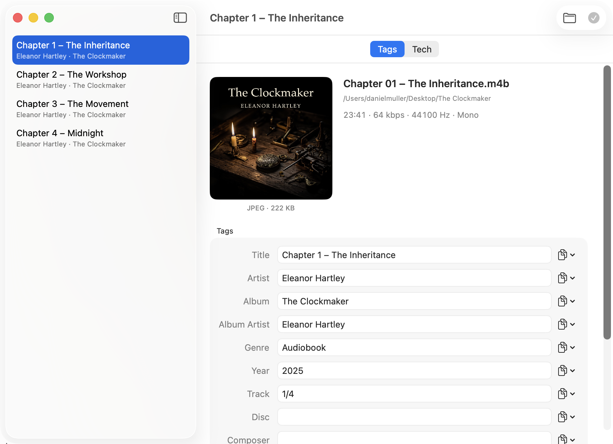
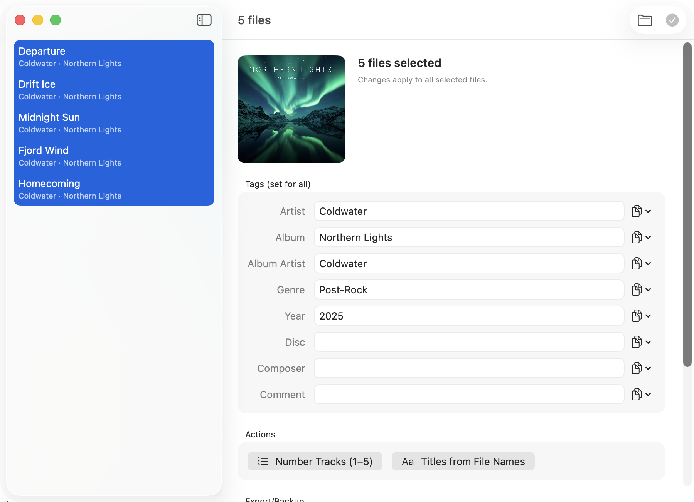
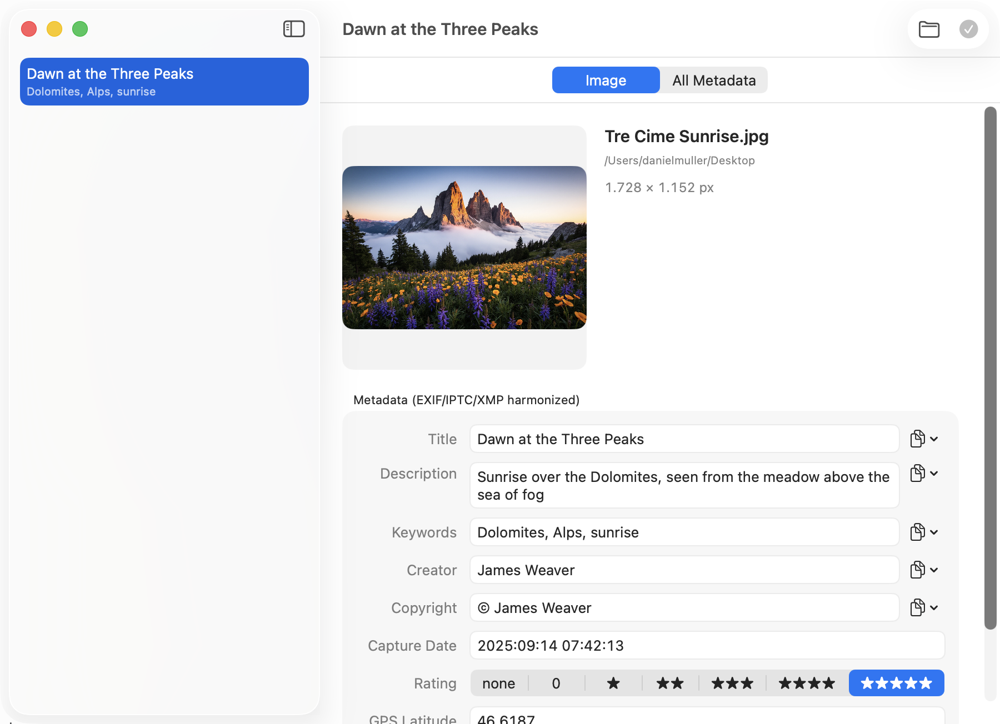
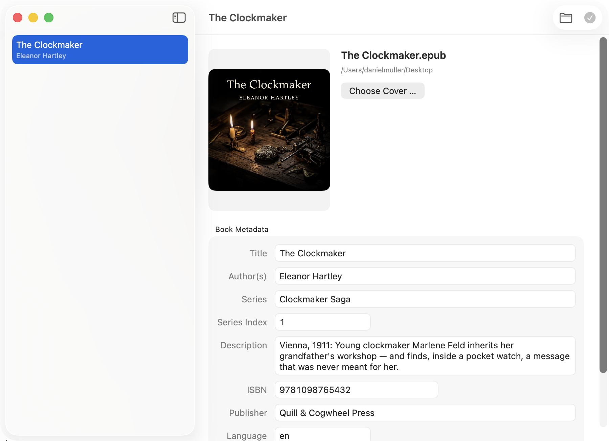
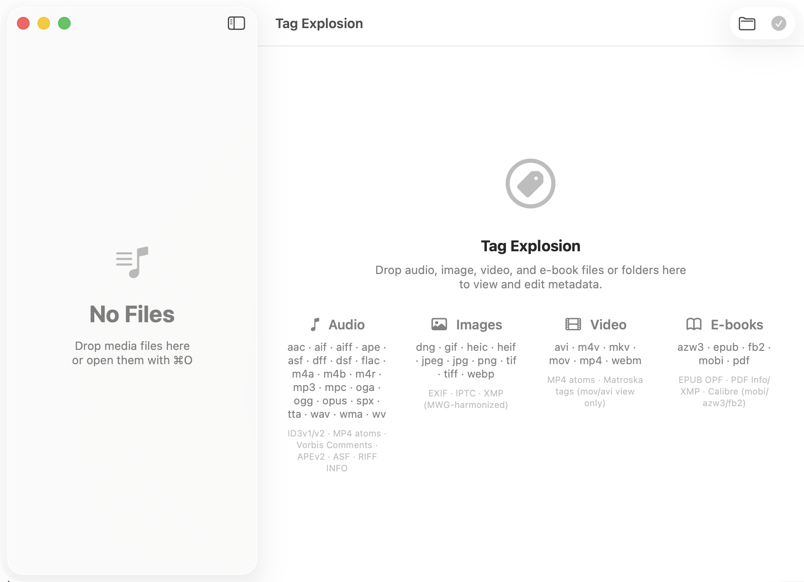

<p align="center">
  
</p>

<h1 align="center">Tag Explosion</h1>

**🌐 Sprache / Language:** [English](README.md) · [Deutsch](README.de.md)

<p align="center">
  <strong>Native macOS app for viewing and editing media metadata — audio tags,
  image metadata (EXIF/IPTC/XMP), video tags, and e-book metadata in one fast,
  Apple-style editor, with a scriptable CLI companion. Also inspects
  e-invoices (ZUGFeRD/Factur-X, XRechnung, Peppol), read-only.</strong>
</p>

<p align="center">
  
  
  
</p>


*The audio editor: cover art, all tag fields, and a copy menu on every field.*

## Features

- **Audio** — every tag field including custom keys, cover art, and batch
  editing: shared fields, track numbering, titles from file names, one cover
  for all files.
  Cover tools: size, format, and checks shown under the cover (too small,
  too large, not square, progressive JPEG, CMYK); shrink to 500/1000/1500 px,
  convert to JPEG, strip image metadata, use `folder.jpg`/`cover.jpg`/
  `front.jpg` from the folder, or export the cover as `folder.jpg` — for one
  file or the whole selection.
- **Online lookup** — "Look up online …" in the single and batch editor
  asks MusicBrainz or Discogs for a release (artist + album, or artist +
  title for a single file) or identifies a file by audio fingerprint via
  AcoustID (`fpcalc` from Homebrew `chromaprint`, needs a free client key).
  Candidates, track assignment (by track number, otherwise duration ±3 s and
  title similarity) and a per-field preview (old → new, cover preview);
  "Apply" only fills the editor, saving stays the usual way. Writes the
  MusicBrainz/Discogs/AcoustID ids too. Nothing is sent unless you enable
  online services in Settings and confirm the privacy notice — see below.
- **Images** — EXIF/IPTC/XMP harmonized the MWG way (title, description,
  keywords, creator, copyright, date, rating, GPS), plus a complete read-only
  view of all raw metadata groups.
- **Camera RAW and XMP sidecars** — cr2, cr3, nef, arw, raf, orf, rw2, pef
  are read via exiftool and never written directly: changes go into the XMP
  sidecar `<name>.xmp` next to the file (created on demand). Sidecar values
  overlay the embedded ones per field when reading, the way Lightroom and
  Bridge do, and the editor marks which values come from the sidecar. A
  `.xmp` on its own opens like an image without pixels. Optional for every
  image format ("write sidecar instead of original", `tagx exif set
  --sidecar`); forced for RAW and for formats exiftool cannot write (bmp, svg).
- **Video** — MP4 and Matroska tags editable; other containers shown
  read-only.
- **Video sidecars** — Kodi/Jellyfin `.nfo` (movie, episodedetails, tvshow,
  musicvideo, album, artist): title, original/sort title, year, premiered,
  plot, outline, tagline, genres, tags, studio, directors, writer, rating,
  age rating, runtime, season/episode; actors, unique ids and artwork are
  shown read-only. Unknown elements, their order and the file's indentation
  survive a save; a URL-only NFO is shown but never written. A video with
  `<name>.nfo` next to it gets an "NFO sidecar" section in its editor; its
  fields are saved together with the entry (⌘S) and count as unsaved changes
  when closing — only the NFO is written unless the video's own tags changed
  too. Subtitles `.srt`/`.vtt`: cue count,
  time span, encoding (UTF-8/BOM/Latin-1), language and flags from the file
  name (`film.en.forced.vtt`), the WebVTT header (title and `Language:`
  editable) and a time shift for all cues (`tagx subtitle shift`).
- **Chapters** — for audiobooks and podcasts: an editable chapter list
  (title, start, end) with import/export as JSON or plain text
  (`HH:MM:SS.mmm Title`, one line per chapter). MP3 (ID3v2 CHAP/CTOC),
  MP4/M4A/M4B (Nero `chpl` and QuickTime chapter track, both written) and
  Matroska/WebM chapters. MP4 stores start times only; the end of a chapter
  is derived from the next start.
- **Tag layers** — MP3 files often carry ID3v1 *and* ID3v2 (sometimes APEv2
  too), WAV carries ID3v2 and RIFF INFO, FLAC Vorbis plus stray ID3 tags. The
  editor lists each layer with its version (ID3v2.3/2.4, APEv2) and field
  count and removes a single layer on request — the other layers and the
  audio stream stay untouched (`tagx layers show` / `tagx layers strip`).
  Optional setting: write ID3v2.3 instead of v2.4 for old players (`tagx set
  --id3v23`); v2.3 stores text as UTF-16 and trims dates to the minute.
- **Lyrics, loudness, podcast fields** — fixed fields with validation:
  multi-line lyrics with language (ID3v2 USLT; MP4 `©lyr`; Vorbis/APE
  `LYRICS`), synchronized lyrics as ID3v2 SYLT with LRC import/export — for
  formats without ID3v2 they live in a `<name>.lrc` sidecar next to the file;
  ReplayGain track/album gain and peak (`-6.50 dB`, `0.987654`) and Opus R128
  (Q7.8 integer, shown as dB) with range checks (gain −60…+60 dB, peak 0…10,
  R128 −32768…32767) — an invalid value is rejected by field name before
  anything is written; podcast fields for MP3 and MP4 (flag, feed URL,
  episode GUID, category, keywords, season, episode, description; ID3v2
  PCST/WFED/TGID/TCAT/TKWD/TVSN/TVEP/TDES, MP4
  pcst/purl/egid/catg/keyw/tvsn/tves/desc/ldes). Loudness values are only
  stored and checked, never calculated from the audio.
- **E-books/documents** — the Calibre-style metadata set (title, authors,
  series, description, cover, ISBN, publisher, language, date, tags). EPUB is
  handled natively, PDF via exiftool; with Calibre installed, mobi/azw3/fb2
  are edited through its `ebook-meta` CLI.
- **Documents** — Office (docx, xlsx, pptx: `docProps/core.xml`),
  OpenDocument (odt, ods, odp: `meta.xml`), comic archives (cbz:
  `ComicInfo.xml`, first page shown as cover) and Markdown with YAML front
  matter: title, authors, subject, description, keywords, publisher,
  language, category, dates plus format-specific extra fields (ComicInfo
  series/number/volume, OOXML revision, any Markdown key). All native, no
  external tools; fields a format cannot store are rejected before writing
  instead of being dropped silently.
- **Playlists and cue sheets** — `.cue` (album header, track list with
  INDEX times and ISRC), `.m3u`/`.m3u8`, `.pls` and `.xspf`: entries with
  resolved paths, missing-file check and total duration. Editable are the
  playlist/album title, performer, date and genre (where the format stores
  them) and the title/performer of each entry; order and paths stay as they
  are, unknown lines, line endings and indentation are preserved. Any
  selection can be exported as m3u8/pls/xspf (paths relative to the
  playlist), and `tagx cue apply` writes a cue sheet's titles, performers and
  track numbers into the referenced audio files (one file per track).
- **E-invoices (read-only)** — detects the standard and profile from the
  specification identifier (BT-24): ZUGFeRD 2.x/Factur-X (MINIMUM through
  EXTENDED), XRechnung, Peppol BIS and plain EN 16931, in both syntaxes
  (UN/CEFACT CII and OASIS UBL, invoices and credit notes), plus orders:
  Order-X (BASIC/COMFORT/EXTENDED, embedded as `order-x.xml`) and Peppol
  Order/OrderResponse — order fields carry Order-X labels instead of BT
  numbers. The document kind (invoice, credit note, order, order response)
  is shown separately. A basic validation lists warnings: missing EN 16931
  mandatory fields (XRechnung: also the Leitweg-ID) and the totals
  arithmetic BT-106 … BT-115 with a tolerance of 0.01 — no full Schematron
  check. Every populated
  field is shown with its EN 16931 business term (BT/BG number and label);
  unmapped fields stay visible with their raw path, and common codes are
  decoded (document type, VAT category, payment means, units). Works on
  standalone XML files and on PDFs with an embedded invoice, which get an
  extra "E-Invoice" tab.
- **File names from tags, tags from file names** — kid3-style patterns such
  as `%{track:2} - %{artist} - %{title}` (any tag key works, `%{track:2}` pads
  with zeros). Renaming shows a preview and refuses conflicts (same target
  name twice, target already taken, empty name); same-name sidecars move
  along (`.xmp` with images, `.lrc` with audio, `.nfo` with videos) and the
  undo history follows the new name; the reverse direction fills
  the fields from the name and is saved the usual way. Available for audio,
  video, images (`%{creator}`, `%{date}`) and e-books (`%{author}`,
  `%{series}`), in the editors and as `tagx rename` / `tagx parse` (dry run by
  default, `--apply`, `--json`).
- **Consistency check** — one report for a folder or selection: missing
  cover art, cover size/format differing within an album, album artist
  differing or missing on a compilation, track and disc numbers (missing,
  zero or negative, gaps, duplicates, no total, above the total), year, genre and album
  spelling differing within an album, empty title/artist/album, the same
  title + artist + duration (±2 s) across all files, and optionally file
  names against a pattern. Files are grouped by album (ALBUM + ALBUMARTIST,
  spelling ignored) or, without an album tag, by folder; images, e-books and
  documents are only checked for an empty title (e-books also for a missing
  cover). Nothing is corrected automatically: the report lists the files,
  a click selects one, and the text can be copied. In the app ("Check…" in
  the batch editor, toolbar button for all loaded files) and as `tagx check`
  (`--json`, `--pattern`, `--only <codes>`, `--fail-on warning|hint` → exit 4).
- **Batch rules as a script** — a JSON rules file that runs in order over a
  selection: `set` (with `%{artist}`-style placeholders), `copy` (optionally
  only into empty fields), `replace` (literal or regex with `$1` groups),
  `case` (upper, lower, title case with a configurable list of small words,
  sentence case), `trim`, `remove` and `number` (track numbers in file name
  or field order, optionally as `n/total`). Each rule can be limited to
  media kinds and a field condition (empty, not empty, equals, contains,
  matches). The batch editor has a rule editor with templates, load/save,
  recent files and a preview table (file, field, old → new); the CLI is
  `tagx apply rules.json [--apply] [--json] <files|folders>` (dry run by
  default, `--example` prints a commented sample file, exit 64 for an
  invalid rules file). Writing goes through the usual safe path.
- **Copy values between tags** — every text field (single-file and batch) can
  take its value from another tag, per file. Works across tag formats (for
  example EXIF → IPTC/XMP), restricted to type-compatible text fields.
- **Safe mode** — before every change, an untouched copy of the file goes to
  the trash, and every write goes through a checked copy of the file. See
  [Keeping your files safe](#keeping-your-files-safe).
- **Tag export/import with auto-backup** — the batch editors export all tags
  of a selection (covers embedded) into one self-contained JSON file and
  restore from it; before batch saves the app automatically writes a
  `tags-backup-<timestamp>.json` next to the files (setting, on by default).
- **Tech panel** — the full `mediainfo` report for any file, filterable and
  copyable.
- **Auto-updates** — via [Sparkle](https://sparkle-project.org); the app only
  installs updates after you confirm.
- **CLI `tagx`** — everything scriptable with JSON output and exit codes:
  `tagx show --json`, `tagx set`, `tagx cover`, `tagx chapters`, `tagx info`,
  `tagx exif`, `tagx ebook`, `tagx doc`, `tagx invoice`.

The app's user interface is available in English and German (it follows the
system language); the CLI speaks English. One exception: the e-invoice view
labels fields with the official German EN 16931 business-term names (as used
by the German XRechnung specification) in both app and CLI — the BT/BG
numbers next to them are language-independent.


*Batch editing: one change applies to all selected files; the copy menus fill
each file from one of its own tags.*


*The image editor with MWG-harmonized EXIF/IPTC/XMP fields.*


*The e-book editor: Calibre-style metadata plus cover for EPUB, PDF, and
Calibre formats.*

## Keeping your files safe

Tag Explosion edits files you cannot easily recreate. Losing an audiobook or a
scanned photo to a botched write would be a poor trade for a corrected artist
name, so the app is built to make that outcome unlikely — and recoverable when
it happens anyway.

**Every change is written to a copy first.** The new version is created next to
the original, then checked (does the file still open, are channels, sample rate
and duration unchanged, is the cover count right), and only then does it replace
the original in a single atomic step. A crash, a format error or a full disk
cannot leave a half-written file behind: either the change is complete, or the
original is untouched. On APFS the copy is a clone, so this costs neither
noticeable time nor disk space.

**Safe mode puts the previous version in the trash.** Before each change, an
untouched copy of the file goes to the trash — collected in one folder per
session and per volume, named `Tag Explosion Backup <timestamp>`. If a change
turns out to be wrong, drag the copy back. To clean up, empty the trash; nothing
piles up in a hidden folder you never look at. On APFS the copy is a clone
again, so it only takes up the space that actually changes. Safe mode is on by
default while the app is young; turn it off under ⌘, or with `--no-backup` /
`TAGX_NO_BACKUP=1` in the CLI.

**Every trash backup is remembered, so you can undo.** Each copy is recorded
in a small journal (`~/Library/Application Support/TagExplosion/backup-journal.json`:
original path, trash path, time, size, SHA-256, trigger). The editor's
"Versions …" button lists the backups of the open file, shows which fields
differ from the current state, and restores a chosen version; "File → Undo
Last Change" (⌘⇧Z) restores the newest one. Restoring is a normal write: the
current state goes to the trash first, so an undo can itself be undone. The
CLI does the same with `tagx history list|diff|restore|prune`. Emptying the
trash ends the history — the journal only indexes copies that still exist,
and nothing is ever deleted from the trash by the app.

**Changes made by other programs are not overwritten silently.** If a file
changed on disk after you opened it, saving stops and asks. Choosing "Save
anyway" is safe as well: the state currently on disk is what safe mode copies to
the trash. Metadata reads are checked before and after as one snapshot — e-book
fields and cover together — and checked again before a no-op result or the
atomic replacement. Replacing a file at the same path is detected by its changed
file identity, not mistaken for the file that was read.

**Before writing, the app checks that there is room.** A batch that would run
out of disk space is refused instead of started.

**Batch saves also write a tag backup.** Before saving more than one file, a
`tags-backup-<timestamp>.json` with the previous state (covers included) is
written next to the files, restorable through the same import path or
`tagx import`.

**Formats the app cannot write safely stay read-only.** Containers that TagLib
cannot write, PDFs without cover support, and e-book formats that need Calibre
but do not have it are shown, not edited. A field that a format cannot store is
rejected before anything is written, not silently dropped.

**Verified by tests, not by hope.** The test suite checks that the audio stream
is bit-identical before and after a tag write, that a failed write leaves the
original byte-for-byte intact, that a read-only file, a read-only folder and a
genuinely full disk are refused, that broken and hostile input (empty,
truncated, random bytes, a leading dash in the file name) cannot damage
anything, and that the trash copy really holds the state from before the change.
These run on every push (see `.github/workflows/tests.yml`).

## Privacy: online services

Tag Explosion never contacts a server on its own — no automatic lookup when a
file opens, no telemetry, no update check outside Sparkle's own opt-in. The
online lookup is off by default (Settings → "Allow online services") and
shows, before the first request, which data goes where: search terms (artist,
album, title, year, track count) to MusicBrainz and Discogs, the release id to
the Cover Art Archive for covers, and an audio fingerprint (not the audio) plus
duration and your client key to AcoustID. Every request carries the user agent
`TagExplosion/<version>` with the project address, as MusicBrainz requires;
requests are limited to one per second per service. A Discogs token and the
AcoustID key are stored in the macOS keychain, not in the preferences; the CLI
takes them from `TAGX_DISCOGS_TOKEN` and `TAGX_ACOUSTID_KEY` and refuses to
send anything unless `TAGX_ONLINE=1` is set (`tagx lookup --privacy` prints
the notice).

## Supported formats

| Media | File formats | Tag formats |
|-------|--------------|-------------|
| Audio | mp3, mp2, m4a, m4b, m4r, mp4, aac, flac, ogg, oga, opus, spx, wav, aiff, aif, aifc, wv, ape, mpc, tta, dsf, dff, wma, asf, mka (no cover) · mod, s3m, xm, it (title and comment only) · au (view only) | ID3v1/v2, MP4 atoms, Vorbis Comments, APEv2, ASF, RIFF INFO, Matroska tags, tracker headers · chapters: ID3v2 CHAP/CTOC, MP4 (Nero + QuickTime), Matroska · tag layers shown and removable per layer for mp3/mp2, wav, aiff, flac, ape, mpc, wv, tta, dsf; ID3v2.3 option for mp3/mp2, wav, aiff, dsf |
| Images | jpg, jpeg, png, heic, heif, tif, tiff, webp, dng, gif, avif, jxl, psd · bmp, svg (sidecar only) · xmp | EXIF, IPTC, XMP (MWG-harmonized) |
| Camera RAW | cr2, cr3, nef, arw, raf, orf, rw2, pef | read embedded; write to XMP sidecar `<name>.xmp` only |
| Video | mp4, m4v, 3gp, 3g2, mkv, webm (editable) · mov, avi, ogv (view only) | MP4 atoms, Matroska tags |
| Video sidecars | nfo (Kodi/Jellyfin XML; URL-only NFOs view only) · srt (view only, language via file name) · vtt (header editable) | NFO elements (unknown ones preserved), WebVTT header; cue time shift for srt/vtt |
| E-books | epub, pdf · mobi, azw3, fb2 (with Calibre) | EPUB OPF, PDF Info/XMP (PDF: no series/cover) |
| Documents | docx, xlsx, pptx · odt, ods, odp · cbz · md, markdown | OOXML core.xml (+ app.xml view only), ODF meta.xml, ComicInfo.xml (cover = first page, view only), YAML front matter (unknown keys preserved) |
| Playlists | cue · m3u, m3u8 · pls · xspf | Cue header/track lines, `#PLAYLIST`/`#EXTINF`, `TitleN`, XSPF title/creator (view: paths, existence, duration; edit: labels only; export: m3u8/pls/xspf) |
| E-invoices (view only) | xml · pdf (embedded invoice) | ZUGFeRD/Factur-X, XRechnung, Peppol BIS, EN 16931 — CII and UBL, fields labeled with BT/BG terms; Order-X and Peppol orders with Order-X labels; basic validation warnings |


*The start screen lists every supported file and tag format.*

## Installation

Download the notarized DMG from the
[Releases](../../releases) page, open it, and drag `TagExplosion.app` onto the
`Applications` folder. `TagExplosion.app` is Apple-Silicon-only (`arm64`) and
requires macOS 14 or later. There is no Intel/x86_64 or universal build.

TagLib ships inside the app bundle. For the full feature set install the two
external tools the app calls:

```sh
brew install mediainfo exiftool   # tech panel, image and PDF metadata
```

If the tools are missing, the app offers this itself at every launch: with
Homebrew present it installs the missing formulae on click, without Homebrew
it points to [brew.sh](https://brew.sh). The offer stops once nothing is
missing or "Don't Ask Again" is chosen.

Optional: with [Calibre](https://calibre-ebook.com) installed the app also
edits mobi/azw3/fb2 through its `ebook-meta` command line tool.

Later updates arrive through the built-in updater
(**Tag Explosion → Check for Updates …**). It fetches the update feed from
GitHub Pages; the app sends no other data.

## CLI

```sh
tagx show --json song.mp3                      # all tags as JSON
tagx set song.mp3 -t ARTIST="Miles Davis"      # set fields
tagx set song.mp3 -c ALBUMARTIST=ARTIST        # copy one tag into another
tagx cover set song.mp3 cover.jpg              # embed cover art
tagx cover info --json *.mp3                   # cover size/format/color plus checks (too small, not square, CMYK …)
tagx cover convert --max-size 1000 --jpeg 0.85 *.flac   # shrink and re-encode the embedded cover (--png, --strip-metadata)
tagx cover from-folder Album/*.mp3             # embed folder.jpg/cover.jpg/front.jpg (or .png) from the folder
tagx cover to-folder song.mp3                  # write the embedded cover as folder.jpg (--force replaces)
tagx chapters show book.m4b --json             # chapters as JSON (times in ms)
tagx chapters set book.m4b --from chapters.txt # replace chapters (JSON or "HH:MM:SS.mmm Title" lines)
tagx chapters clear book.m4b                   # remove all chapters
tagx layers show song.mp3 --json               # tag layers (ID3v1/ID3v2/APE …) with version and fields
tagx layers strip song.mp3 --layer id3v1       # remove one layer, keep the others
tagx set song.mp3 -t TITLE=X --id3v23          # write ID3v2.3 instead of v2.4 (old players)
tagx lyrics set song.mp3 --from song.lrc --language deu   # LRC → SYLT (+ text, language)
tagx lyrics set song.flac --from song.lrc      # no ID3v2: writes the song.lrc sidecar
tagx lyrics set song.mp3 --from song.lrc --sidecar   # force the sidecar; refused while SYLT exists (embedded wins)
tagx lyrics show song.mp3 --lrc                # synchronized lines as LRC (SYLT, else the sidecar)
tagx lyrics export song.mp3                    # → song.lrc (or .txt without sync)
tagx set song.mp3 -t REPLAYGAIN_TRACK_GAIN="-6.50 dB" PODCAST=1 TVSEASON=2   # range-checked, exit 1 if invalid
tagx exif set photo.jpg --copy description=IFD0:ImageDescription
tagx exif set IMG_0001.cr2 --rating 5        # RAW: written to IMG_0001.xmp
tagx exif set photo.jpg --sidecar --title X  # any image: sidecar instead of file
tagx ebook set book.epub --series "Foundation" --series-index 2
tagx doc set report.docx --title "Q3 report" --keywords "sales, 2026"
tagx doc set comic.cbz --custom Series=Foo Number=2   # ComicInfo extra fields
tagx playlist show album.cue                   # header, tracks, resolved paths, missing files, total duration
tagx playlist set list.m3u8 --title "Mix" --entry-title 2="Second song"
tagx playlist export --out Album/album.m3u8 Album/*.flac   # relative paths; --absolute, --format pls|xspf
tagx cue apply album.cue --apply               # write cue titles/performers/track numbers into the audio files
tagx nfo set movie.mkv --title "Title" --year 2019    # writes movie.nfo, not the video
tagx subtitle show movie.en.srt --json         # cues, span, encoding, language
tagx subtitle shift movie.srt --seconds=-1.5   # shift all cues (negative: use "=")
tagx check Music/ --json                       # consistency report per album/folder (covers, track gaps, empty fields …)
tagx check Album/ --fail-on warning            # exit 4 on warnings; --only track-gap,missing-cover; -p '%{track:2} - %{title}'
tagx history list song.mp3                     # trash backups of this file (undo history), newest first
tagx history restore song.mp3 --version 1 --apply   # bring back the newest backup (dry run without --apply)
tagx apply --example > rules.json              # commented sample rules file
tagx apply rules.json Album/                   # preview: FIELD: old -> new per file
tagx apply rules.json --apply Album/           # write the changes (trash copy, atomic replace)
tagx export Album/ -o tags.json                # back up all tags (covers embedded)
tagx import --dry-run tags.json                # preview a restore
tagx info video.mkv                            # full mediainfo report
tagx invoice invoice.pdf                       # e-invoice profile, warnings + all fields (BT terms)
tagx invoice order.xml --strict                # exit 3 if the basic validation reports warnings
TAGX_ONLINE=1 tagx lookup Album/*.flac         # MusicBrainz candidates + plan (old -> new), dry run
TAGX_ONLINE=1 tagx lookup --source discogs --choose 2 --apply --cover Album/*.flac   # write candidate 2 incl. cover
TAGX_ONLINE=1 TAGX_ACOUSTID_KEY=… tagx lookup --source acoustid song.mp3   # identify by fingerprint (fpcalc); exit 5 = no match
tagx set song.mp3 -t ARTIST="X" --no-backup    # skip the safety copy in the trash
```

Imports only target files inside the JSON file's directory by default. An
archive that intentionally references external files requires the explicit
`--allow-external-targets` flag; `tagx` prints the complete resolved target
list before applying it. Ratings accept only integers from 0 through 5; only
an explicitly empty `--rating` value deletes the field.

## Building from source

Requirements: Xcode toolchain, Homebrew with `taglib`; `mediainfo` at
runtime, optional `exiftool` and `ffmpeg` for the tests.

```sh
./build.sh          # builds tagx and TagExplosion.app in the project folder
swift test          # tests generate their own fixtures
swift test --package-path App   # app tests (headless, no window)
```

With an Apple Developer ID in the keychain there are two more scripts. Both ask
once for the local notarytool keychain profile and remember its name for this
clone only:

```sh
./install.sh        # notarized build, installed to /Applications
./release.sh        # notarized DMG with background image, ready to publish
```

`install.sh` copies to `/Applications` only after stapler, Gatekeeper and the
signature confirm the bundle really is notarized; `./install.sh --no-notarize`
builds a quick test bundle that stays in the project folder. If the installed
bundle fails its final checks, an existing installation is restored; a rejected
first installation is removed again.

The core library and CLI are kept free of AppKit/SwiftUI and build and test on
Linux as well (CI job on Ubuntu 24.04; `scripts/linux-deps.sh` installs the
dependencies and builds TagLib 2.3.1 from source because the distribution
package is still TagLib 1.x). Safe mode works there too: the backup copy goes
to the freedesktop trash (`~/.local/share/Trash`, or `.Trash-<uid>` on the
file's own volume), where every file manager shows it. See
[docs/PLAN.md](docs/PLAN.md) for architecture and milestones and
[docs/sparkle-release.md](docs/sparkle-release.md) for the release process.

## License

MIT (see [LICENSE](LICENSE)), © 2026 Daniel Müller.

TagLib (LGPL-2.1-or-later or MPL-1.1) is linked dynamically and shipped
inside the app bundle, so it stays replaceable. The library code itself is
untouched; bundling only rewrites the install names to point at the bundle's
framework folder and re-signs the files. Sparkle (MIT),
ZIPFoundation (MIT), and swift-argument-parser (Apache-2.0) are linked as
well. mediainfo (BSD-2), exiftool (Artistic/GPL), and Calibre's `ebook-meta`
(GPL) are neither bundled nor linked — they are only invoked as external
programs. The e-invoice field labels follow the semantic model of EN 16931
and the UNTDID/UN/ECE code lists; no text from the standard documents is
reproduced, the short labels are written in the project's own wording. Full
licence texts and the reasoning:
[THIRD-PARTY-NOTICES.md](THIRD-PARTY-NOTICES.md).

The demo files and cover art in the screenshots are entirely generated for
this documentation — the titles, authors, and artists do not exist.
