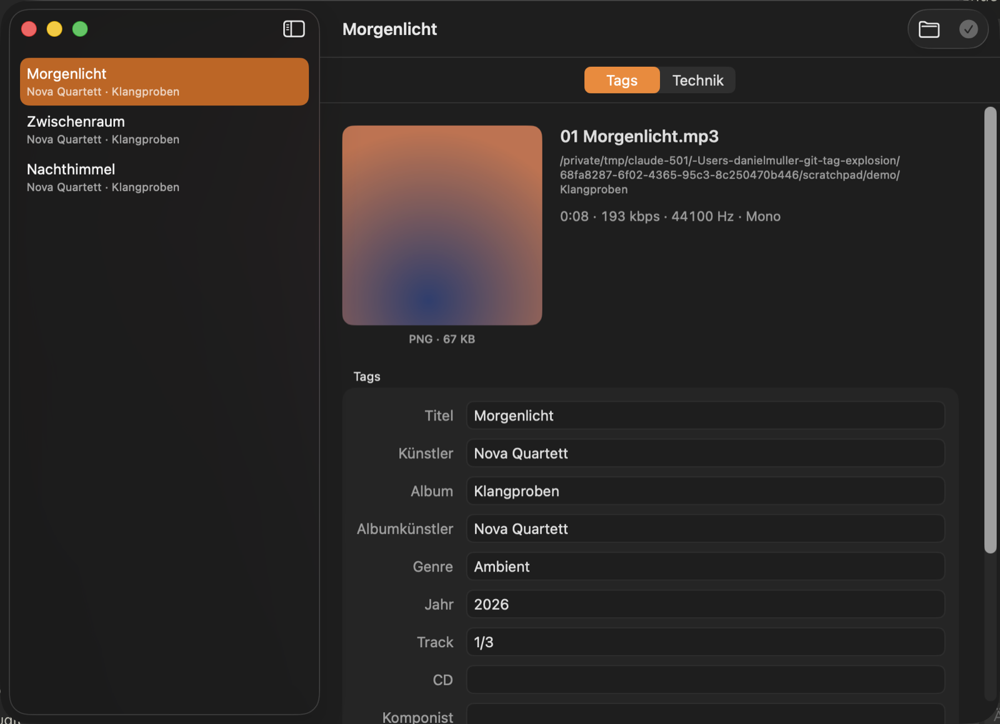
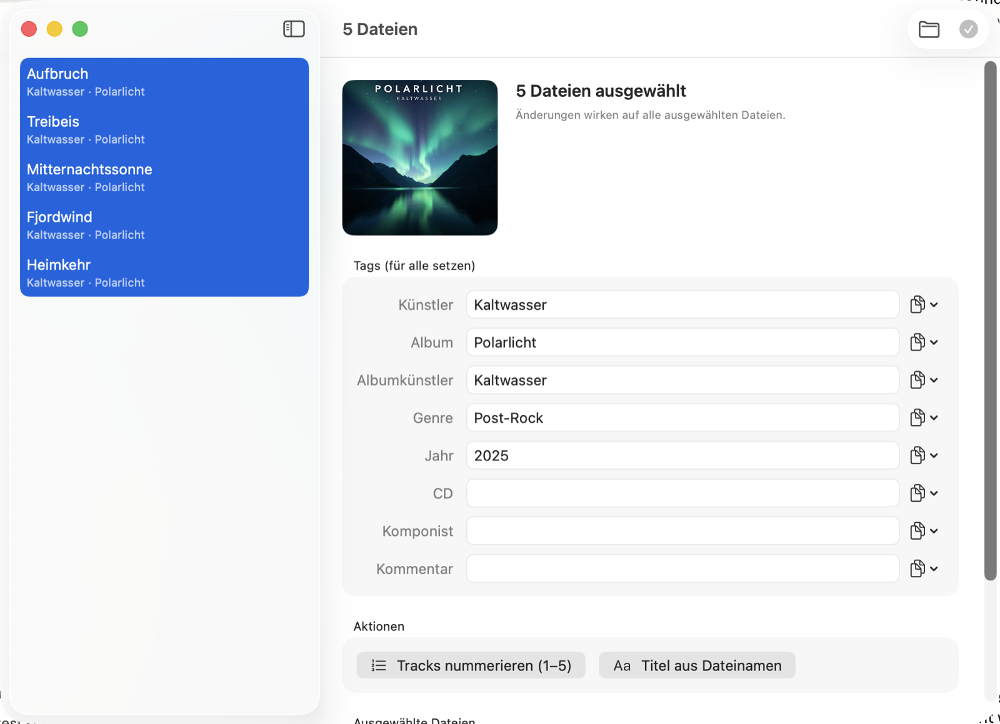
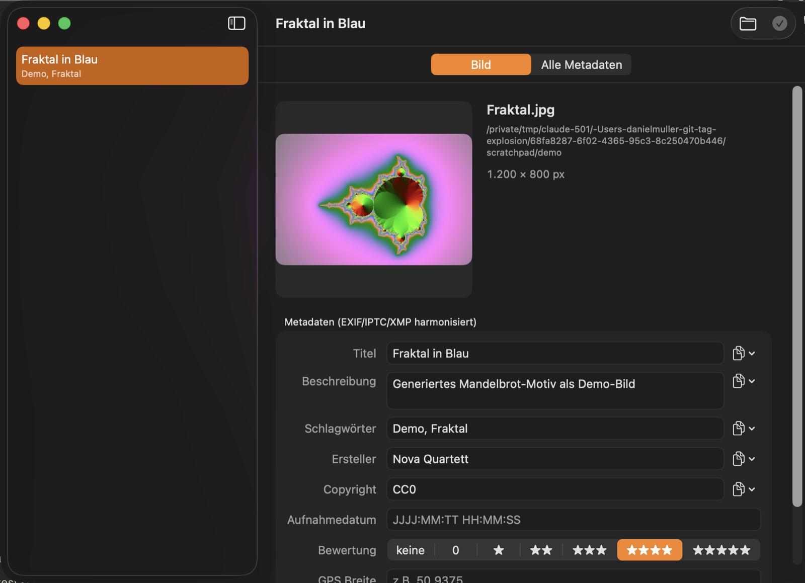
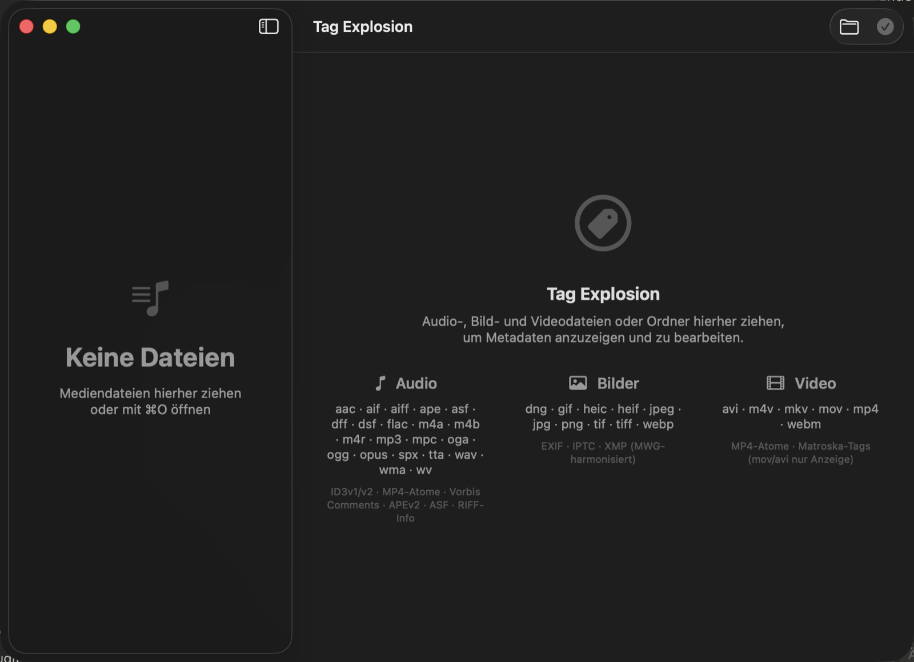

# Tag Explosion

Native macOS app for viewing and editing media metadata — audio tags, image
metadata (EXIF/IPTC/XMP), and video tags in one fast, Apple-style editor,
with a scriptable CLI companion.

**🌐 Sprache / Language:** [English](README.md) · [Deutsch](README.de.md)



*The audio editor: cover art, all tag fields, and a copy menu on every field.*

## Features

- **Audio** — every tag field including custom keys, cover art, and batch
  editing: shared fields, track numbering, titles from file names, one cover
  for all files.
- **Images** — EXIF/IPTC/XMP harmonized the MWG way (title, description,
  keywords, creator, copyright, date, rating, GPS), plus a complete read-only
  view of all raw metadata groups.
- **Video** — MP4 and Matroska tags editable; other containers shown
  read-only.
- **Copy values between tags** — every text field (single-file and batch) can
  take its value from another tag, per file. Works across tag formats (for
  example EXIF → IPTC/XMP), restricted to type-compatible text fields.
- **Tech panel** — the full `mediainfo` report for any file, filterable and
  copyable.
- **Auto-updates** — via [Sparkle](https://sparkle-project.org); the app only
  installs updates after you confirm.
- **CLI `tagx`** — everything scriptable with JSON output and exit codes:
  `tagx show --json`, `tagx set`, `tagx cover`, `tagx info`, `tagx exif`.

The app's user interface is currently German; the CLI and this documentation
are bilingual-friendly.


*Batch editing: one change applies to all selected files; the copy menus fill
each file from one of its own tags.*


*The image editor with MWG-harmonized EXIF/IPTC/XMP fields.*

## Supported formats

| Media | File formats | Tag formats |
|-------|--------------|-------------|
| Audio | mp3, m4a, m4b, m4r, mp4, aac, flac, ogg, oga, opus, spx, wav, aiff, aif, wv, ape, mpc, tta, dsf, dff, wma, asf | ID3v1/v2, MP4 atoms, Vorbis Comments, APEv2, ASF, RIFF INFO |
| Images | jpg, jpeg, png, heic, heif, tif, tiff, webp, dng, gif | EXIF, IPTC, XMP (MWG-harmonized) |
| Video | mp4, m4v, mkv, webm (editable) · mov, avi (view only) | MP4 atoms, Matroska tags |


*The start screen lists every supported file and tag format.*

## Installation

Download the notarized DMG from the
[Releases](../../releases) page, open it, and drag `TagExplosion.app` onto the
`Applications` folder. Requires macOS 14 or later (Apple Silicon and Intel).

TagLib ships inside the app bundle. For the full feature set install the two
external tools the app calls:

```sh
brew install mediainfo exiftool   # tech panel and image metadata
```

Later updates arrive through the built-in updater
(**Tag Explosion → Nach Updates suchen …**).

## CLI

```sh
tagx show --json song.mp3                      # all tags as JSON
tagx set song.mp3 -t ARTIST="Miles Davis"      # set fields
tagx set song.mp3 -c ALBUMARTIST=ARTIST        # copy one tag into another
tagx cover set song.mp3 cover.jpg              # embed cover art
tagx exif set photo.jpg --copy description=IFD0:ImageDescription
tagx info video.mkv                            # full mediainfo report
```

## Building from source

Requirements: Xcode toolchain, Homebrew with `taglib`; `media-info` at
runtime, optional `ffmpeg` for test fixtures.

```sh
./build.sh          # builds tagx and TagExplosion.app
swift test          # tests generate their own fixtures
```

The core library and CLI are kept free of AppKit/SwiftUI so they stay portable
to Linux. See [docs/PLAN.md](docs/PLAN.md) for architecture and milestones and
[docs/sparkle-release.md](docs/sparkle-release.md) for the release process.

## License

MIT (see [LICENSE](LICENSE)). TagLib is linked dynamically as a system library
(LGPL/MPL); mediainfo (BSD-2) and exiftool (Artistic) are only invoked as
external programs. Details in [THIRD-PARTY.md](THIRD-PARTY.md).

The demo files and cover art in the screenshots are entirely generated for
this documentation — the titles, authors, and artists do not exist.
